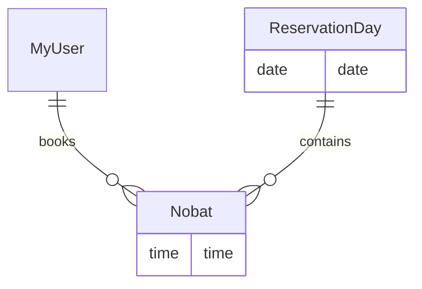

<div align="center">

# 🩺 Doctor Appointment System (Django)

**A Django web app where patients register with their phone number and book, view and cancel doctor appointment slots.**


</div>

---

## ✨ Features

- 📱 **Phone-based accounts** - custom user model that signs in with a phone number *or* email (custom authentication backend).
- 🗓️ **Automatic time slots** - a helper (`Home/utils/turn_maker.py`) creates reservation days and 30-minute slots for the next days, with morning and evening sessions, skipping the Persian weekend (uses the Jalali calendar via `khayyam`).
- ✅ **Book an appointment** - pick a free slot and confirm it on a confirmation page.
- 📋 **My appointments** - patients can see and cancel their bookings.
- 📨 **Contact-us messages** stored from the account app.
- 🛠️ **Django admin** to manage days, slots and users.

## 🧩 Data model



## 🚀 Getting Started

The project is stored as a zip archive (`Doc_appointment_django-master.zip`).

```bash
git clone https://github.com/Arashomranpour/Doc_appointment_django.git
cd Doc_appointment_django
unzip Doc_appointment_django-master.zip
cd Doc_appointment_django-master

python -m venv .venv && source .venv/bin/activate   # Windows: .venv\Scripts\activate
pip install django khayyam pillow

python manage.py migrate
python manage.py createsuperuser
python manage.py runserver
```

Open http://127.0.0.1:8000/.

## 🔗 Main routes

| Route | Purpose |
|---|---|
| `/` | Home - available days and slots |
| `/reserve/<id>/` | Reserve a slot |
| `/reserve/confirm/<id>/` | Confirm a reservation |
| `/my-appointments/` | List the current user's appointments |
| `/cancel/<id>/` | Cancel an appointment |

## 📁 Project Structure

```
Doc_appointment_django-master/
├── manage.py
├── Home/        # Reservation days, slots (Nobat), views, slot generator
└── account/     # Custom user model, phone/email auth backend, contact form
```

## 🛠️ Tech Stack

`Python` · `Django` · `SQLite` · `khayyam (Jalali calendar)`
